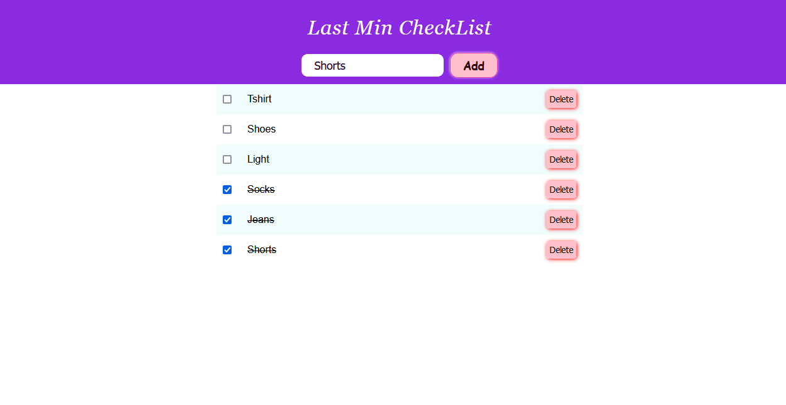

# To-Do-app
This is a basic todo app.
You can add, check and delete the list items.

## Tech Stacks Used

- JavaScript
- HTML
- CSS
- Json Server
- Heroku

   
   
   
   
   
 

## Demo

Click the below link for demo

[Demo Netlify Link](https://to-do-list-archie.netlify.app/)
